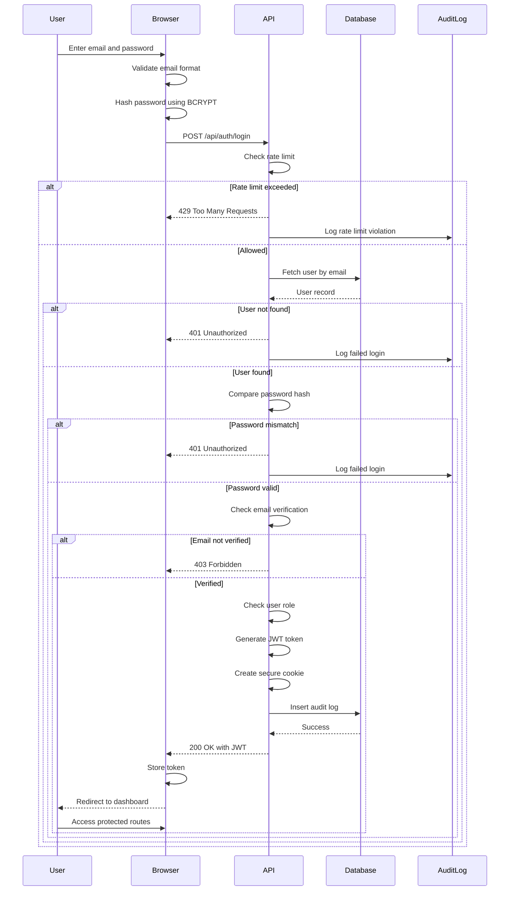
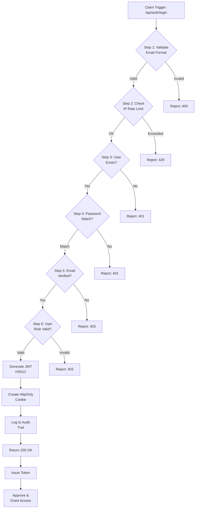
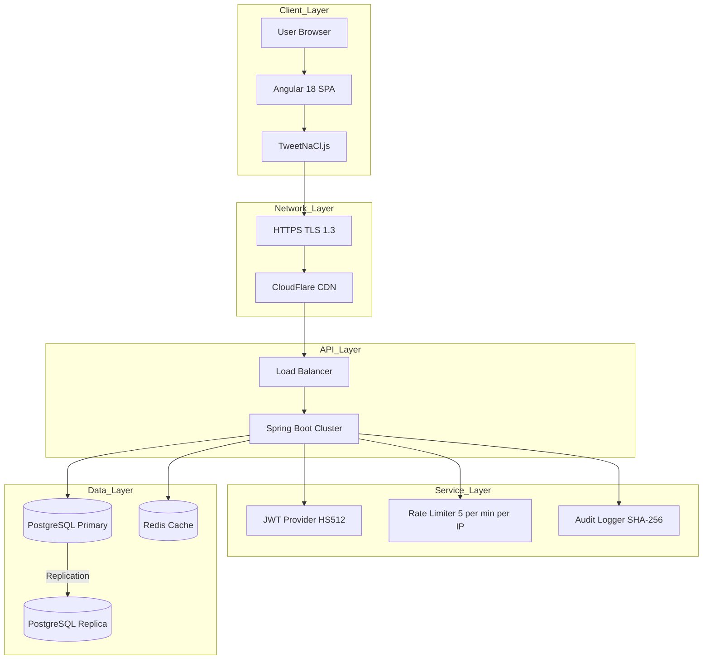
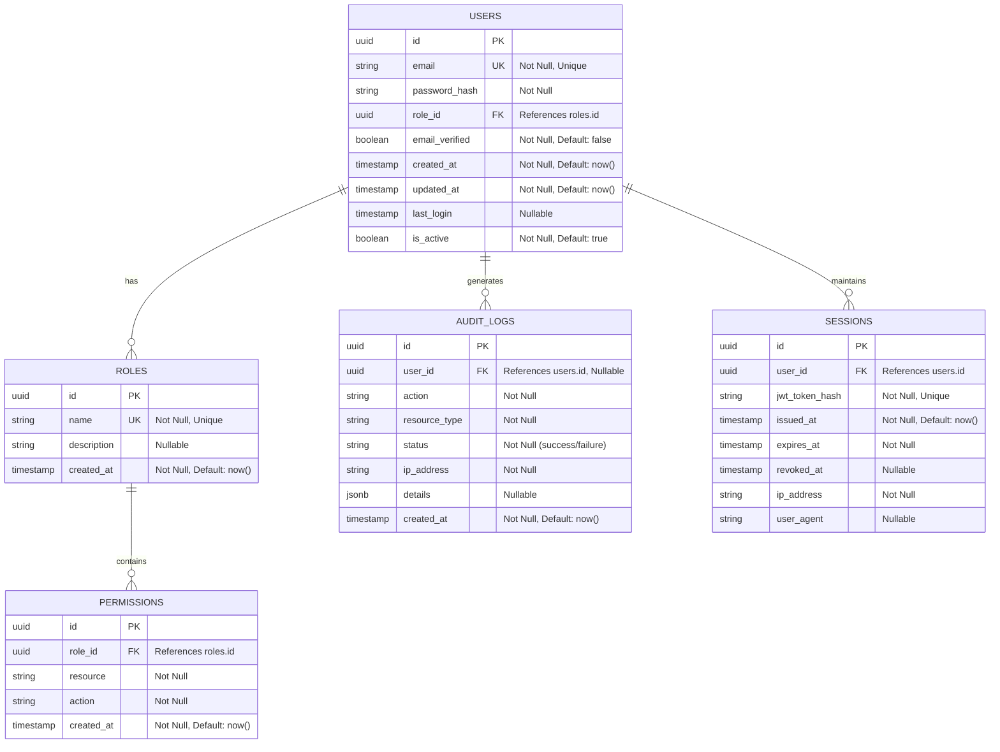

# BridgeSoft Login & Authorization System
**Secure Login Page with Role-Based Access Control**

**Document Version:** 2.0  
**Format:** GIG-I Problem-Solution-Architecture  
**Date Created:** April 15, 2026  
**Status:** Ready for Development  
**Last Updated:** April 15, 2026

---

## Table of Contents

1. [The Problem](#the-problem)
2. [Our Solution](#our-solution)
3. [Core Architectural Principles](#core-architectural-principles)
4. [Authentication & Authorization Rules](#authentication--authorization-rules)
5. [Login Flow & Security](#login-flow--security)
6. [System Architecture & Components](#system-architecture--components)
7. [API Contracts](#api-contracts)
8. [Technology Stack](#technology-stack)
09. [Risk & Mitigation](#risk--mitigation)
10. [Success Metrics](#success-metrics)

---

## The Problem

Applications need secure login pages with proper authentication and authorization:

### 1. **Insecure Credential Handling**
- Missing HTTPS/TLS encryption exposes passwords in transit
- Weak password hashing (MD5, SHA1) compromised in seconds
- Passwords stored plaintext or with insufficient cryptography
- No rate limiting allows brute-force attacks

### 2. **Unauthorized Access**
- Users can access resources beyond their role/permission level
- No role-based access control (RBAC) — everyone sees everything
- Admin panels accessible to regular users
- No logout mechanism; sessions never expire

### 3. **Security Vulnerabilities**
- SQL injection in login form opens database to attackers
- XSS (Cross-Site Scripting) in password field compromises stored credentials
- CSRF (Cross-Site Request Forgery) allows hijacking of login flows
- Missing security headers (HSTS, CSP, X-Frame-Options)

### Real-World Impact
- **Unauthorized access** costs companies $4.29M per breach (IBM 2023)
- **Credential reuse** leads to account takeover across platforms
- **Compliance failures** (GDPR, SOC2, PCI-DSS) result in penalties and loss of trust
- **Downtime** from security incidents disrupts operations

---

## Our Solution

**Our App Login Page** is a secure, role-based login system with strong authentication and authorization controls.

### What Our App Login Does

**Authenticate:**
- Secure password hashing (BCRYPT, strength factor 12)
- HTTPS/TLS 1.3 encryption for all data in transit
- JWT tokens (HS512) with 24-hour expiration
- Rate limiting (5 attempts/min/IP) prevents brute-force attacks
- Email/password validation with OWASP standards

**Authorize:**
- Role-Based Access Control (RBAC): USER, ADMIN, MODERATOR
- Protected routes based on JWT claims
- Admin-only endpoints for audit logs and user management
- Fine-grained permissions per role

**Secure:**
- SQL injection prevention via parameterized queries
- XSS prevention via Angular sanitization + CSP headers
- CSRF protection via SameSite cookies
- Secure session management (HttpOnly, Secure flags)
- Audit logging of all login attempts

### Core Value Propositions
1. **Strong security** – industry-standard BCRYPT hashing, TLS 1.3, OWASP compliance
2. **Role-based access** – differentiate USER, ADMIN, MODERATOR with fine-grained permissions
3. **Attack resistance** – rate limiting, input validation, SQL injection/XSS prevention
4. **Compliance-ready** – audit logs, encryption, session management meet SOC2/GDPR requirements
5. **Simple to integrate** – 4 REST endpoints, JWT-based, stateless architecture

---

## Core Architectural Principles

BridgeSoft Login is built on four core principles:

### 1. **Secure by Default**
Every credential is encrypted. Every endpoint requires authentication. Every database query is parameterized. Security is baked in, not bolted on.

### 2. **Defense in Depth**
Multiple overlapping controls. If input validation fails, parameterized queries catch SQL injection. If HTTPS fails, HttpOnly cookies prevent XSS. No single point of failure.

### 3. **Principle of Least Privilege**
Users get only the permissions they need. Admins can do administrative tasks. Regular users cannot access admin panels. Roles are explicit, not implicit.

### 4. **Observability & Auditability**
Every login attempt logged. Why was this user approved/rejected? What role was assigned? Audit trail immutable and tamper-proof. Compliance-ready.

---

## Authentication & Authorization Rules

### Authentication Requirements

| Component | Setting | Rationale |
|---|---|---|
| **Password Hashing** | BCRYPT strength 12 | ~100ms per operation; brute-force resistant |
| **Minimum Password Length** | 8 characters | Balance security vs. user friction |
| **Password Complexity** | 1 uppercase, 1 number | OWASP standard |
| **JWT Algorithm** | HS512 (HMAC-SHA512) | Fast, symmetric; secure for stateless auth |
| **Token Expiration** | 24 hours | Short-lived but reduces re-auth burden |
| **TLS Version** | 1.3 minimum | Forward secrecy mandatory |
| **Rate Limiting** | 5 attempts / minute / IP | Stops brute-force; allows legitimate retry |
| **Session Timeout** | Inactivity logout (optional) | Reduces window of token theft |

### Authorization: Role-Based Access Control (RBAC)

| Role | Permissions | Examples |
|---|---|---|
| **USER** | Read own profile, update password | View personal dashboard, change email |
| **ADMIN** | Manage all users, view audit logs | Add/remove users, see login history |
| **MODERATOR** | Review content, manage reports | Approve/reject pending items |
| **GUEST** | Read public data only | View public pages (no login) |

### Security Controls

| Control | Implementation |
|---|---|
| **SQL Injection** | Parameterized queries (JPA @Query with ?1, ?2) |
| **XSS Prevention** | Angular sanitization + Content Security Policy header |
| **CSRF Protection** | SameSite=Strict on cookies |
| **Password Storage** | BCRYPT with random salt (auto-generated) |
| **Token Storage** | HttpOnly, Secure, SameSite=Strict cookies |
| **Audit Logging** | SHA-256 hashing of all events; immutable trail |
| **HTTPS/TLS** | 1.3 minimum; enforce redirecthttp → https |
| **Headers** | HSTS, CSP, X-Frame-Options, X-Content-Type-Options |

---

## Login Flow & Security

### Login Decision Logic

```
if (email NOT in database):
  → Return 401 (Unauthorized)
  → Log failed attempt
  → Increment IP rate limit counter

if (password_hash does NOT match stored hash):
  → Return 401 (Unauthorized)
  → Log failed attempt
  → Increment IP rate limit counter

if (IP rate limit exceeded 5/min):
  → Return 429 (Too Many Requests)
  → Block IP for 60 seconds
  → Log rate limit violation

if (email verified = false):
  → Return 403 (Forbidden)
  → Show "Please verify email" message
  → Resend verification link button

if (user role = ADMIN):
  → Check additional admin permissions
  → Log admin login

→ Generate JWT (HS512, 24-hour expiration)
→ Set HttpOnly + Secure + SameSite=Strict cookie
→ Log successful login (user, IP, timestamp)
→ Return 200 with user profile + token
```

### End-to-End Login Sequence Diagram



---

## System Architecture & Components

### Zero-Trust Validation Pipeline



### High-Level System Architecture



### Frontend (Angular Login Page)
- Email + password input with validation
- Client-side BCRYPT password hashing (TweetNaCl.js)
- HTTP interceptor: attaches JWT to all API requests
- Route guards: protect /dashboard, /admin based on role
- Error handling: 401, 403, 429 responses with user-friendly messages

### Backend (Spring Boot API)
- 4 endpoints: /login, /register, /logout, /profile
- Spring Security + JWT provider (JJWT library)
- Rate limiting middleware (Redis + in-memory fallback)
- Parameterized queries (Hibernate JPA)
- Audit logging service (immutable trail)

### Database (PostgreSQL)

#### Entity Relationship Diagram (ERD)



#### Detailed Table Schemas

##### 1. users Table (Primary User Entity)

| Column | Type | Constraint | Description |
|--------|------|-----------|-------------|
| id | UUID | PRIMARY KEY | Unique user identifier (auto-generated) |
| email | VARCHAR(255) | UNIQUE, NOT NULL | Email address (unique constraint) |
| password_hash | VARCHAR(60) | NOT NULL | BCRYPT hashed password (always 60 chars) |
| role_id | UUID | FOREIGN KEY (roles.id), NOT NULL | References user's role |
| email_verified | BOOLEAN | NOT NULL, DEFAULT: false | Email verification status |
| created_at | TIMESTAMP | NOT NULL, DEFAULT: NOW() | Account creation timestamp |
| updated_at | TIMESTAMP | NOT NULL, DEFAULT: NOW() | Last profile update timestamp |
| last_login | TIMESTAMP | NULLABLE | Last successful login timestamp |
| is_active | BOOLEAN | NOT NULL, DEFAULT: true | Account active/inactive status |

**Indexes:**
- `CREATE UNIQUE INDEX idx_users_email ON users(email);`
- `CREATE INDEX idx_users_role_id ON users(role_id);`
- `CREATE INDEX idx_users_created_at ON users(created_at);`

##### 2. roles Table (Role Definition)

| Column | Type | Constraint | Description |
|--------|------|-----------|-------------|
| id | UUID | PRIMARY KEY | Unique role identifier |
| name | VARCHAR(50) | UNIQUE, NOT NULL | Role name (USER, ADMIN, MODERATOR) |
| description | TEXT | NULLABLE | Role description and purpose |
| created_at | TIMESTAMP | NOT NULL, DEFAULT: NOW() | Role creation timestamp |

**Indexes:**
- `CREATE UNIQUE INDEX idx_roles_name ON roles(name);`

**Sample Data:**
```sql
INSERT INTO roles (id, name, description, created_at) VALUES
('550e8400-e29b-41d4-a716-446655440001', 'USER', 'Standard user with basic permissions', NOW()),
('550e8400-e29b-41d4-a716-446655440002', 'ADMIN', 'Administrator with full system access', NOW()),
('550e8400-e29b-41d4-a716-446655440003', 'MODERATOR', 'Content moderator with review permissions', NOW());
```

##### 3. permissions Table (Role-Based Permissions)

| Column | Type | Constraint | Description |
|--------|------|-----------|-------------|
| id | UUID | PRIMARY KEY | Unique permission identifier |
| role_id | UUID | FOREIGN KEY (roles.id), NOT NULL | References assigned role |
| resource | VARCHAR(100) | NOT NULL | Resource name (users, audit_logs, profile) |
| action | VARCHAR(50) | NOT NULL | Action type (CREATE, READ, UPDATE, DELETE) |
| created_at | TIMESTAMP | NOT NULL, DEFAULT: NOW() | Permission creation timestamp |

**Composite Constraints:**
- `CREATE UNIQUE INDEX idx_permissions_role_resource_action ON permissions(role_id, resource, action);`

**Indexes:**
- `CREATE INDEX idx_permissions_role_id ON permissions(role_id);`
- `CREATE INDEX idx_permissions_resource ON permissions(resource);`

**Sample Permissions:**
```sql
-- USER role permissions
INSERT INTO permissions (role_id, resource, action) VALUES
('550e8400-e29b-41d4-a716-446655440001', 'profile', 'READ'),
('550e8400-e29b-41d4-a716-446655440001', 'profile', 'UPDATE');

-- ADMIN role permissions
INSERT INTO permissions (role_id, resource, action) VALUES
('550e8400-e29b-41d4-a716-446655440002', 'users', 'CREATE'),
('550e8400-e29b-41d4-a716-446655440002', 'users', 'READ'),
('550e8400-e29b-41d4-a716-446655440002', 'users', 'UPDATE'),
('550e8400-e29b-41d4-a716-446655440002', 'users', 'DELETE'),
('550e8400-e29b-41d4-a716-446655440002', 'audit_logs', 'READ');
```

##### 4. audit_logs Table (Immutable Audit Trail)

| Column | Type | Constraint | Description |
|--------|------|-----------|-------------|
| id | UUID | PRIMARY KEY | Unique audit log entry identifier |
| user_id | UUID | FOREIGN KEY (users.id), NULLABLE | User who performed action (null for anonymous) |
| action | VARCHAR(50) | NOT NULL | Action performed (LOGIN, LOGOUT, REGISTER, etc.) |
| resource_type | VARCHAR(100) | NOT NULL | Resource type (USER, ROLE, SESSION, etc.) |
| status | VARCHAR(20) | NOT NULL | Status outcome (success, failure, rate_limited) |
| ip_address | VARCHAR(45) | NOT NULL | IPv4 or IPv6 address |
| details | JSONB | NULLABLE | Additional structured data (email, error reason, etc.) |
| created_at | TIMESTAMP | NOT NULL, DEFAULT: NOW() | Log entry creation timestamp (immutable) |

**Indexes:**
- `CREATE INDEX idx_audit_logs_user_id ON audit_logs(user_id);`
- `CREATE INDEX idx_audit_logs_action ON audit_logs(action);`
- `CREATE INDEX idx_audit_logs_created_at ON audit_logs(created_at DESC);`
- `CREATE INDEX idx_audit_logs_ip_address ON audit_logs(ip_address);`
- `CREATE INDEX idx_audit_logs_status ON audit_logs(status);`

**Sample Audit Entry:**
```json
{
  "id": "650e8400-e29b-41d4-a716-446655440100",
  "user_id": "550e8400-e29b-41d4-a716-446655440000",
  "action": "LOGIN",
  "resource_type": "SESSION",
  "status": "success",
  "ip_address": "192.168.1.100",
  "details": {
    "email": "user@example.com",
    "role": "USER",
    "user_agent": "Mozilla/5.0..."
  },
  "created_at": "2026-04-15T10:20:45Z"
}
```

##### 5. sessions Table (Active Session Management)

| Column | Type | Constraint | Description |
|--------|------|-----------|-------------|
| id | UUID | PRIMARY KEY | Unique session identifier |
| user_id | UUID | FOREIGN KEY (users.id), NOT NULL | User who owns session |
| jwt_token_hash | VARCHAR(64) | UNIQUE, NOT NULL | SHA-256 hash of JWT token (for validation) |
| issued_at | TIMESTAMP | NOT NULL, DEFAULT: NOW() | JWT issuance timestamp |
| expires_at | TIMESTAMP | NOT NULL | JWT expiration timestamp (24 hours from issue) |
| revoked_at | TIMESTAMP | NULLABLE | Explicit revocation timestamp (logout) |
| ip_address | VARCHAR(45) | NOT NULL | IPv4/IPv6 address of session origin |
| user_agent | VARCHAR(500) | NULLABLE | Browser/client user agent string |

**Indexes:**
- `CREATE UNIQUE INDEX idx_sessions_jwt_token_hash ON sessions(jwt_token_hash);`
- `CREATE INDEX idx_sessions_user_id ON sessions(user_id);`
- `CREATE INDEX idx_sessions_expires_at ON sessions(expires_at);`
- `CREATE INDEX idx_sessions_revoked_at ON sessions(revoked_at);`

**Partitioning Strategy (for large scale):**
- Partition on `expires_at` by month to efficiently clean up expired sessions
- Run cleanup job: `DELETE FROM sessions WHERE expires_at < NOW() AND revoked_at IS NULL;`

#### Foreign Key Relationships

```sql
-- users → roles (Many-to-One)
ALTER TABLE users ADD CONSTRAINT fk_users_role_id 
  FOREIGN KEY (role_id) REFERENCES roles(id) ON DELETE RESTRICT;

-- permissions → roles (Many-to-One)
ALTER TABLE permissions ADD CONSTRAINT fk_permissions_role_id 
  FOREIGN KEY (role_id) REFERENCES roles(id) ON DELETE CASCADE;

-- audit_logs → users (Many-to-One, NULLABLE)
ALTER TABLE audit_logs ADD CONSTRAINT fk_audit_logs_user_id 
  FOREIGN KEY (user_id) REFERENCES users(id) ON DELETE SET NULL;

-- sessions → users (Many-to-One)
ALTER TABLE sessions ADD CONSTRAINT fk_sessions_user_id 
  FOREIGN KEY (user_id) REFERENCES users(id) ON DELETE CASCADE;
```

#### Data Integrity Constraints

```sql
-- Email format validation (optional, handled in app layer)
ALTER TABLE users ADD CONSTRAINT chk_users_email 
  CHECK (email ~ '^[A-Za-z0-9._%+-]+@[A-Za-z0-9.-]+\.[A-Z|a-z]{2,}$');

-- Password length validation (BCRYPT always 60 chars)
ALTER TABLE users ADD CONSTRAINT chk_users_password_hash_length 
  CHECK (LENGTH(password_hash) = 60);

-- Session expiration integrity
ALTER TABLE sessions ADD CONSTRAINT chk_sessions_expiration 
  CHECK (expires_at > issued_at);

-- Status enum constraint
ALTER TABLE audit_logs ADD CONSTRAINT chk_audit_logs_status 
  CHECK (status IN ('success', 'failure', 'rate_limited', 'unauthorized'));
```

#### Sample DDL Creation Scripts

```sql
-- Create roles table
CREATE TABLE IF NOT EXISTS roles (
  id UUID PRIMARY KEY DEFAULT gen_random_uuid(),
  name VARCHAR(50) UNIQUE NOT NULL,
  description TEXT,
  created_at TIMESTAMP NOT NULL DEFAULT NOW()
);

-- Create users table
CREATE TABLE IF NOT EXISTS users (
  id UUID PRIMARY KEY DEFAULT gen_random_uuid(),
  email VARCHAR(255) UNIQUE NOT NULL,
  password_hash VARCHAR(60) NOT NULL,
  role_id UUID NOT NULL REFERENCES roles(id) ON DELETE RESTRICT,
  email_verified BOOLEAN NOT NULL DEFAULT FALSE,
  created_at TIMESTAMP NOT NULL DEFAULT NOW(),
  updated_at TIMESTAMP NOT NULL DEFAULT NOW(),
  last_login TIMESTAMP,
  is_active BOOLEAN NOT NULL DEFAULT TRUE
);

-- Create permissions table
CREATE TABLE IF NOT EXISTS permissions (
  id UUID PRIMARY KEY DEFAULT gen_random_uuid(),
  role_id UUID NOT NULL REFERENCES roles(id) ON DELETE CASCADE,
  resource VARCHAR(100) NOT NULL,
  action VARCHAR(50) NOT NULL,
  created_at TIMESTAMP NOT NULL DEFAULT NOW(),
  UNIQUE(role_id, resource, action)
);

-- Create audit_logs table
CREATE TABLE IF NOT EXISTS audit_logs (
  id UUID PRIMARY KEY DEFAULT gen_random_uuid(),
  user_id UUID REFERENCES users(id) ON DELETE SET NULL,
  action VARCHAR(50) NOT NULL,
  resource_type VARCHAR(100) NOT NULL,
  status VARCHAR(20) NOT NULL CHECK (status IN ('success', 'failure', 'rate_limited', 'unauthorized')),
  ip_address VARCHAR(45) NOT NULL,
  details JSONB,
  created_at TIMESTAMP NOT NULL DEFAULT NOW()
);

-- Create sessions table
CREATE TABLE IF NOT EXISTS sessions (
  id UUID PRIMARY KEY DEFAULT gen_random_uuid(),
  user_id UUID NOT NULL REFERENCES users(id) ON DELETE CASCADE,
  jwt_token_hash VARCHAR(64) UNIQUE NOT NULL,
  issued_at TIMESTAMP NOT NULL DEFAULT NOW(),
  expires_at TIMESTAMP NOT NULL,
  revoked_at TIMESTAMP,
  ip_address VARCHAR(45) NOT NULL,
  user_agent VARCHAR(500),
  CHECK (expires_at > issued_at)
);

-- Create all indexes
CREATE UNIQUE INDEX idx_users_email ON users(email);
CREATE INDEX idx_users_role_id ON users(role_id);
CREATE INDEX idx_users_created_at ON users(created_at);
CREATE UNIQUE INDEX idx_roles_name ON roles(name);
CREATE INDEX idx_permissions_role_id ON permissions(role_id);
CREATE INDEX idx_permissions_resource ON permissions(resource);
CREATE INDEX idx_audit_logs_user_id ON audit_logs(user_id);
CREATE INDEX idx_audit_logs_action ON audit_logs(action);
CREATE INDEX idx_audit_logs_created_at ON audit_logs(created_at DESC);
CREATE INDEX idx_audit_logs_ip_address ON audit_logs(ip_address);
CREATE INDEX idx_audit_logs_status ON audit_logs(status);
CREATE UNIQUE INDEX idx_sessions_jwt_token_hash ON sessions(jwt_token_hash);
CREATE INDEX idx_sessions_user_id ON sessions(user_id);
CREATE INDEX idx_sessions_expires_at ON sessions(expires_at);
```

#### Backup & Recovery Strategy

- **Full backup:** Daily at 2:00 AM UTC (WAL-based)
- **Incremental backup:** Hourly via PostgreSQL WAL archiving
- **Audit log retention:** Minimum 7 years (compliance: GDPR, SOC2)
- **Session cleanup:** Automatic deletion of expired sessions (>24 hours)
- **Disaster recovery:** Multi-region replica with automatic failover

### Technology Stack

| Layer | Component | Version |
|---|---|---|
| **Frontend** | Angular | 18+ (LTS) |
| | TypeScript | 5.0+ |
| **Backend** | Java | 21 (LTS) |
| | Spring Boot | 3.2+ |
| | Spring Security | 6.2+ |
| | JJWT | 0.12+ |
| **Database** | PostgreSQL | 14+ |
| **Cache** | Redis | 7.0+ |
| **DevOps** | Docker | 24.0+ |
| | Kubernetes | 1.28+ |

---

## API Contracts

### Endpoints

| Method | Endpoint | Auth | Purpose |
|---|---|---|---|
| POST | `/api/auth/login` | None | Authenticate with email + password |
| POST | `/api/auth/logout` | Yes | Clear JWT token |
| GET | `/api/users/profile` | Yes | Fetch current user profile |
| GET | `/api/admin/audit-logs` | ADMIN | View all login attempts |

### POST /api/auth/login — Success (200)

**Request:**
```json
POST /api/auth/login
Content-Type: application/json

{
  "email": "user@example.com",
  "password_hash": "$2a$12$..."
}
```

**Response:**
```json
HTTP/1.1 200 OK
Set-Cookie: jwt=eyJ...; HttpOnly; Secure; SameSite=Strict; Max-Age=86400
Content-Type: application/json

{
  "status": "success",
  "user": {
    "id": "550e8400-e29b-41d4-a716-446655440000",
    "email": "user@example.com",
    "role": "USER"
  },
  "token": {
    "type": "Bearer",
    "expires_in": 86400
  }
}
```

### POST /api/auth/login — Failed (401 Unauthorized)

```json
HTTP/1.1 401 Unauthorized
Content-Type: application/json

{
  "status": "error",
  "error": "Invalid email or password",
  "code": "INVALID_CREDENTIALS"
}
```

### POST /api/auth/login — Rate Limited (429)

```json
HTTP/1.1 429 Too Many Requests
Content-Type: application/json

{
  "status": "error",
  "error": "Too many login attempts. Try again in 60 seconds.",
  "code": "RATE_LIMIT_EXCEEDED",
  "retry_after_seconds": 60
}
```

### GET /api/users/profile — Success (200)

```json
HTTP/1.1 200 OK
Authorization: Bearer eyJ...
Content-Type: application/json

{
  "id": "550e8400-e29b-41d4-a716-446655440000",
  "email": "user@example.com",
  "role": "USER",
  "email_verified": true,
  "created_at": "2026-04-10T14:30:00Z",
  "last_login": "2026-04-15T10:20:45Z"
}
```

### JWT Token Structure

**Payload:**
```json
{
  "sub": "550e8400-e29b-41d4-a716-446655440000",
  "email": "user@example.com",
  "role": "USER",
  "iat": 1712100000,
  "exp": 1712186400
}
```

---


## Risk & Mitigation

| # | Risk | Probability | Impact | Mitigation |
|---|---|---|---|---|
| 1 | **Weak Password Hashing** | Medium | High | Use BCRYPT strength 12 (mandatory); never use MD5/SHA1 |
| 2 | **SQL Injection via Login Form** | Medium | High | Use parameterized queries (JPA @Query with ?1); validate email format |
| 3 | **XSS in Password Field** | Low | High | Angular sanitization + Content Security Policy header |
| 4 | **CSRF Attack on Login** | Low | Medium | SameSite=Strict on cookies; CSRF token on form (optional) |
| 5 | **Brute-Force Attack** | High | Medium | Rate limiting 5 attempts/min/IP; block for 60 sec |
| 6 | **Token Theft (XSS)** | Medium | High | HttpOnly + Secure + SameSite cookies; never localStorage |
| 7 | **HTTPS Not Enforced** | High | High | Enforce http → https redirect; HSTS header |
| 8 | **JWT Key Leak** | Low | High | Store secret in environment variables; rotate keys quarterly |
| 9 | **Missing Audit Logging** | Medium | Medium | Log all login attempts; immutable audit_logs table |
| 10 | **Authorization Bypass** | Medium | High | Check JWT role claim; enforce role checks on backend (not frontend) |

---

## Success Metrics

| Metric | Target | Measurement |
|---|---|---|
| **Login Success Rate** | >99% | (successful logins) / (total attempts) |
| **Login Latency (P99)** | <100ms | 99th percentile response time |
| **Security Compliance** | 100% | OWASP Top 10 + BCRYPT + TLS 1.3 |
| **Rate Limiting** | 5/min/IP | Blocks 6th attempt; 60 sec cooldown |
| **Audit Logging** | 100% | All logins logged (success + failure) |
| **Code Coverage** | >85% | Unit + integration test lines |
| **Password Hashing** | BCRYPT 12 | ~100ms per hash; brute-force resistant |
| **Uptime** | 99.5% | Login endpoint availability |
| **Zero SQL Injection** | 100% | Parameterized queries enforced |
| **Zero XSS** | 100% | Angular sanitization + CSP header |

---

**This document is CONFIDENTIAL. Distribute only to authorized team members.**

